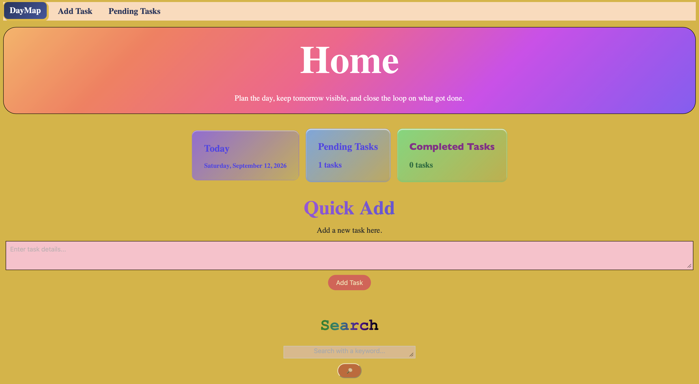
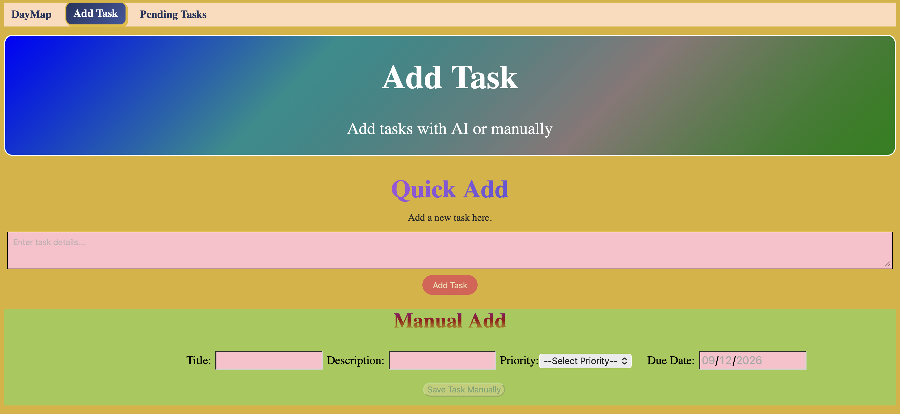
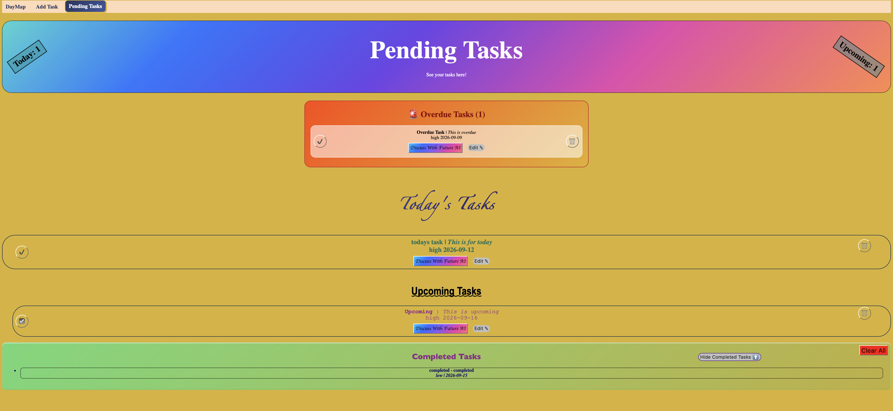
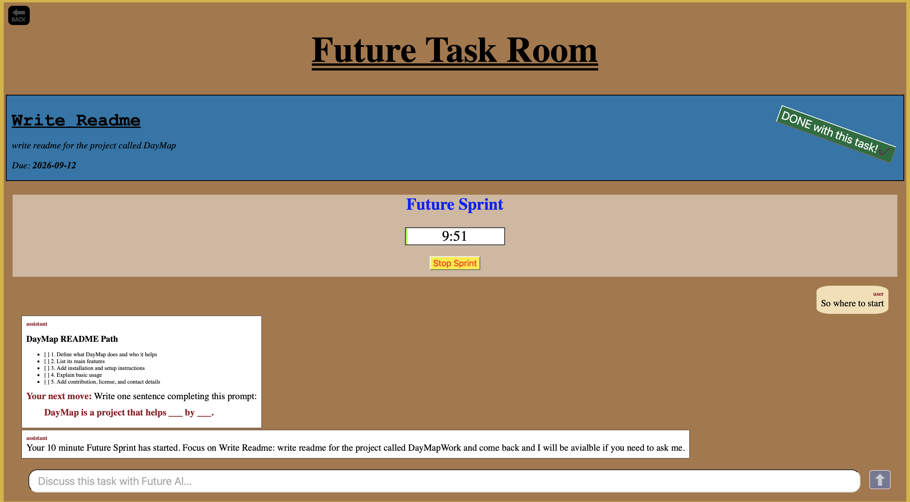

# DayMap (Plan your Future)

A very smart to-do app that helps you brainstorm, ask questions and a basic to-do app features. I built this to do 2 things, **learn** react and **manage** school and coding.

## Overview

The app has a lot of features that are useful, below are some useful features that stand out for me.

- The `Quick Add` (with AI), I just write a raw rough idea and it adds a clear task into my task list.

- Really good `UI` (according to me).

- Able `edit` tasks.

- *`MVP`*  `Discuss with FUTURE AI feature`, this is a game changer and it is really helpful, powered by gpt 5.6 sol and with context memory.

- `Future Sprint`, a focus timer that is on while you speedrun your task for free time in future.

## Try it out here - [Link]()

# Peek below to see how the app looks

## The above is the home page looks good and very useful, more like an overview.

## This page is basically creating tasks with AI and manually. Classic!

## As you can see the aabove page is a real deal and very useful.

## A very useful feature, helps user brainstorm, answer questions, talk and check their work with gpt 5.6 sol (one of the best models now).

---
I hope you like this project and it took me about 45 hrs to build this. I used about ~9%(hackatime). I used Ai to help me on bugs and some stuff i messed up.

Thanks. This project is DONE!✅
